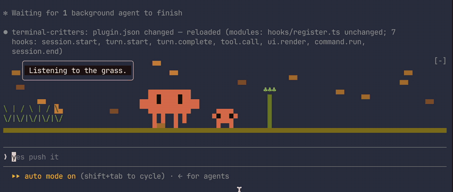

# terminal-critters

A little pixel critter that keeps you company in [Claude Code](https://code.claude.com) while Claude works: a fan-made homage to Claude's orange mascot. Every turn it shows up in a small animated world above your prompt (an asteroid field, a deep dive, a meadow, a dungeon, a factory), reacts to what Claude is doing, and comments in a speech bubble:



- **It reacts to real work.** Each tool call shows up in the scene: a file Claude reads becomes a sign in the meadow, a command becomes a crate on the factory belt, a search pattern drifts through space.
- **It brings friends.** Every busy agent gets a small helper critter tagging along, up to five.
- **Each session has its own world.** A session keeps one scene for its whole life, resumes included, and sessions opened side by side get different ones, so you can tell your terminals apart at a glance.
- **It stays out of the way.** It draws only while Claude or one of its background agents is working, only in the terminal, and stops its timer when Claude is idle.
- **It touches nothing.** No file access, no network, no processes, no model calls. Run `claude plugin validate plugins/terminal-critters` and see for yourself.

> Requires Claude Code **v2.1.287 or later** (the first version with [mods](https://code.claude.com/docs/en/plugins/mods/overview)). Works in the terminal; the Desktop app and VS Code panel don't draw it.

## Install

In Claude Code:

```
/plugin marketplace add 3333444n/terminal-critters
/plugin install terminal-critters@terminal-critters
```

Or from your shell:

```bash
claude plugin marketplace add 3333444n/terminal-critters
claude plugin install terminal-critters@terminal-critters
```

If a session is already open, run `/reload-plugins` in it. Then ask Claude to do something and watch the band above the prompt.

## Turn it off

Didn't like it? No hard feelings. Pick how far you want to go:

| How far | Do this | Undo |
| --- | --- | --- |
| **Hide it for now** | Press `ctrl+x` then `ctrl+a` to collapse the band above the prompt | Press it again |
| **Switch the critters off** (remembered across sessions) | `/critters off` | `/critters on` |
| **Disable the plugin** | `/plugin` → **Installed** → terminal-critters → Disable, or in your shell: `claude plugin disable terminal-critters@terminal-critters` | `claude plugin enable terminal-critters@terminal-critters` |
| **Uninstall it** | `claude plugin uninstall terminal-critters@terminal-critters` | Install it again |
| **Remove the marketplace too** | `claude plugin marketplace remove terminal-critters` (also uninstalls the plugin) | Add it again |
| **Emergency: one session with no mods at all** | Start Claude Code with `claude --safe-mode` | Start it normally |

After disabling or uninstalling from your shell, run `/reload-plugins` in any open session (or restart it).

## Commands

| Command | What it does |
| --- | --- |
| `/critters` | Help and current status |
| `/critters off` / `/critters on` | Switch the critters off or on. Remembered across sessions. |
| `/critters list` | List the scenes |
| `/critters scene <name>` | Always use one scene, in every session. `/critters scene auto` goes back to one scene per session (the default). |
| `/critters next` | Give this session another scene (it keeps it) |
| `/critters preview [name]` | Show a scene for 12 seconds, even while Claude is idle |

All of them work while Claude is mid-turn.

## Scenes

| Id | Scene | Tool calls become |
| --- | --- | --- |
| `space` | Asteroid Field | bugs `}o{` drifting through the stars |
| `ocean` | Deep Dive | bubbles floating up |
| `meadow` | Bug Meadow | little signposts |
| `dungeon` | Loop Dungeon | scarabs guarding their names |
| `factory` | Response Factory | crates on the conveyor belt |

**Want to add one?** Scenes are one small TypeScript file each. See [CONTRIBUTING.md](CONTRIBUTING.md).

## How it works

terminal-critters is a Claude Code **mod**: a plugin whose code runs inside Claude Code and hooks its events.

- `tool.call` tells the director what Claude is doing (the kind of work plus a short label like a file name).
- `ui.render` on the `AbovePrompt` site draws the band as one `Raster`, a grid of colored cells. Every cell holds two "pixels" using the `▀`/`▄` half blocks.
- A `$.clock.every` timer repaints the Raster with `$.ui.blit` about 15 times a second, and stops itself once nothing is on screen.

```
plugins/terminal-critters/
├── .claude-plugin/plugin.json
├── hooks/
│   ├── hooks.json        points Claude Code at register.ts
│   ├── register.ts       the hooks: events in, frames out, /critters
│   ├── director.ts       runs one turn's show: scene, bubble, helpers
│   ├── canvas.ts         the pixel canvas and the Raster packing
│   ├── critter.ts        the critter's sprites (walk + blink)
│   ├── captions.ts       the shared speech-bubble lines
│   ├── work.ts           tool call → kind of work + label
│   ├── scene.ts          the Scene contract
│   └── scenes/           one file per scene
└── tests/critters.test.ts
```

## Develop locally

```bash
git clone https://github.com/3333444n/terminal-critters
cd terminal-critters
claude --plugin-dir ./plugins/terminal-critters   # loads it and reloads on save
```

Then `/critters preview ocean` to see a scene without waiting for a turn.

```bash
claude plugin validate plugins/terminal-critters   # what it hooks and calls, and anything Claude Code would refuse
claude plugin test plugins/terminal-critters       # the tests
```

## Roadmap

- An opt-in narrator: a small model writes the speech bubble from what Claude is actually doing (off by default, since it spends usage)
- More scenes, and scenes picked by the kind of work (searching → ocean, tests → dungeon)
- A celebration frame when a turn finishes

## Credits and license

The code is MIT licensed.

**Fan art notice:** the critter is an unofficial, non-commercial, fan-made homage to Claude's mascot. Claude and its mascot belong to Anthropic; this project isn't affiliated with or endorsed by Anthropic, and the MIT license covers the code, not the character. If Anthropic asks, the sprite will be changed or removed. Please don't use the critter commercially.
